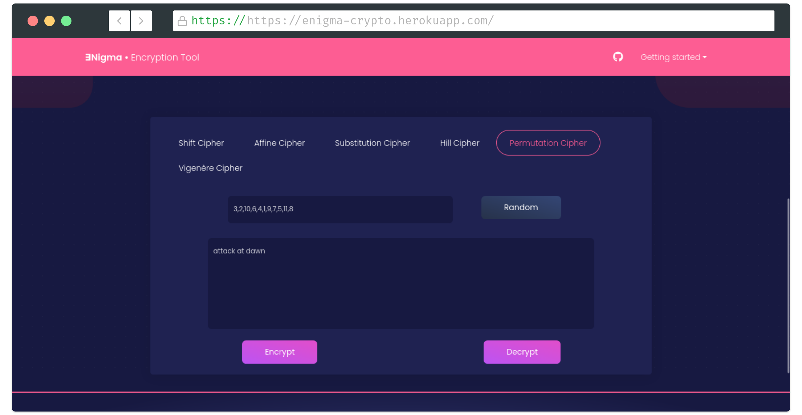
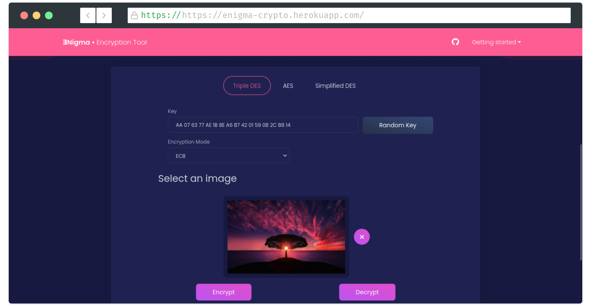
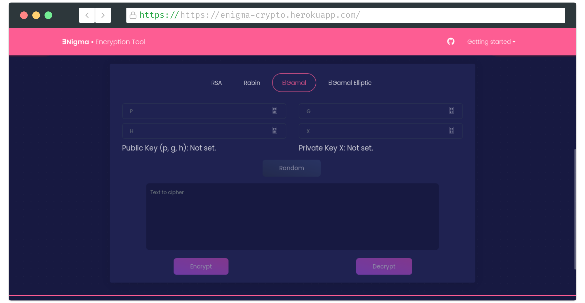

<div id="top"></div>

<div align="center">
  <a href="https://github.com/DavidFM43/enigma">
    
  </a>
  <h1 align="center">Enigma</h1>
Enigma is a web-based cryptography tool that allows you to encrypt, decrypt, and attack texts and images using a variety of classic and modern ciphers, including block ciphers
  <p align="center">

  </p>

  Deployed Project: [https://www.tracjam.com.co/](https://www.tracjam.com.co/ )

  **Note**: The project is currently offline due to because heroku free tier no longer exists.
</div>

<!-- ABOUT THE PROJECT -->
## Features

<!-- [](https://tracjam.com.co) -->

Enigma supports the following cryptsystems:

**Classic ciphers**



The following ciphers are implemented for text encryption only:

- Shift cipher
- Affine cipher   
- Substitution cipher
- Hill cipher
- Permutation cipher
- Vigenere cipher

**Block ciphers**



The following cipher are implemented for image encyption:

- Triples DES
- AES
- Simplified DES(text only)

**Public ciphers**



The following ciphers are implemented for text encryption only:

- RSA
- Rabin
- ElGamal (Discrete Logarithm)
- ElGamal (Eliptic Curve)


### Tech Stack

* [![Python][Python.com]][Python-url]
* [![Flask][Flask.com]][Flask-url]
* [![Heroku][Heroku.com]][Heroku-url]
* [![angular][angular]][Heroku-url]


<!-- GETTING STARTED -->
## Getting Started

This app is deployed on website, however if you want to deploy it in your local machine you need to:
- Install Node >= 16.* and NPM [Download](https://nodejs.org/en/download/)

To begin, install Angular-CLI with npm using the following command:
```bash
npm install -g @angular/cli
```

Next, please follow the next steps to install the `requirements`:

```bash
# We assume you are in the root folder of the repo
cd backend

# It's recommended to do the following command inside a virtual environment
pip install -r requirements.txt
```
Set the FLASK_APP environment variable:

```bash
(Unix/Mac) export FLASK_APP=colossus
(Windows) set FLASK_APP=colossus
(Powershell) $env:FLASK_APP="colossus"

```
4. Run the application backend locally:
```bash
flask run
```
Now for the frontend: 

```bash
# We assume you are in the root folder of the repo
cd frontend

npm install 
ng serve 
```

Now you can go to `http://localhost:4200` and test the app.


<!-- MARKDOWN LINKS & IMAGES -->
<!-- https://www.markdownguide.org/basic-syntax/#reference-style-links -->
[contributors-shield]: https://img.shields.io/github/contributors/github_username/repo_name.svg?style=for-the-badge
[contributors-url]: https://github.com/github_username/repo_name/graphs/contributors
[forks-shield]: https://img.shields.io/github/forks/github_username/repo_name.svg?style=for-the-badge
[forks-url]: https://github.com/github_username/repo_name/network/members
[stars-shield]: https://img.shields.io/github/stars/github_username/repo_name.svg?style=for-the-badge
[stars-url]: https://github.com/github_username/repo_name/stargazers
[issues-shield]: https://img.shields.io/github/issues/github_username/repo_name.svg?style=for-the-badge
[issues-url]: https://github.com/github_username/repo_name/issues
[license-shield]: https://img.shields.io/github/license/github_username/repo_name.svg?style=for-the-badge
[license-url]: https://github.com/github_username/repo_name/blob/master/LICENSE.txt
[linkedin-shield]: https://img.shields.io/badge/-LinkedIn-black.svg?style=for-the-badge&logo=linkedin&colorB=555
[linkedin-url]: https://linkedin.com/in/linkedin_username
[product-screenshot]: images/screenshot.png
[Plotly.com]: https://img.shields.io/badge/Plotly-%233F4F75.svg?style=for-the-badge&logo=plotly&logoColor=white
[Plotly-url]: https://plotly.com/
[Dash.com]: https://img.shields.io/badge/dash-%23150458.svg?style=for-the-badge&logo=plotly&logoColor=white
[Dash-url]: https://dash.plotly.com/
[Pandas.com]: https://img.shields.io/badge/pandas-%23150458.svg?style=for-the-badge&logo=pandas&logoColor=white
[Pandas-url]: https://pandas.pydata.org/
[Python.com]: https://img.shields.io/badge/python-3670A0?style=for-the-badge&logo=python&logoColor=ffdd54
[Python-url]: https://www.python.org/ 
[Heroku.com]: https://img.shields.io/badge/heroku-%23430098.svg?style=for-the-badge&logo=heroku&logoColor=white
[angular]: https://img.shields.io/badge/Angular-DD0031?style=for-the-badge&logo=angular&logoColor=white
[angular-url]: https://angular.io/
[Heroku-url]: https://www.heroku.com/
[sklearn.com]: https://img.shields.io/badge/scikit--learn-%23F7931E.svg?style=for-the-badge&logo=scikit-learn&logoColor=white
[sklearn-url]: https://scikit-learn.org/
[PostgreSQL]: https://img.shields.io/badge/postgresql-%23316192.svg?style=for-the-badge&logo=postgresql&logoColor=white
[Postgresql-url]: https://www.postgresql.org/
[Postgres.com]: https://img.shields.io/badge/postgresql-%2523316192.svg?style=for-the-badge&logo=postgresql&logoColor=white
[Postgresql-url]: https://www.postgresql.org/
[Flask.com]: https://img.shields.io/badge/flask-%23000.svg?style=for-the-badge&logo=flask&logoColor=white
[Flask-url]: https://flask.palletsprojects.com/en/2.1.x/
